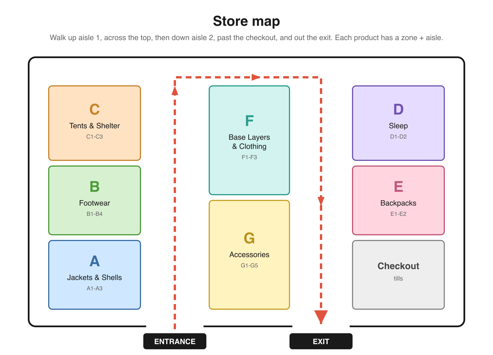

# Sample dataset

A small, made-up product catalog for a Swiss outdoor retailer, so you have realistic data to build against. 47 products expand into 227 variants (one row per color and size) across 7 store zones, each with a valid scannable barcode, query-friendly tags, a store location, and stock counts.

Everything here is fictional (brands, prices, barcodes). Use it freely.

## Files

- `products.json`: the catalog as typed JSON (lists stay lists). Best for code and AI.
- `products.csv`: the same catalog as CSV (lists joined with `;`). Best for spreadsheets.
- `store-map.png`: the store floor plan (shown below).

## Fields

Each row is one product in one color and one size. Variants of the same product share a `product_id`.

| Field | Type | Notes |
|-------|------|-------|
| `product_code` | string | Valid EAN-13 barcode, unique per variant. Scans with Scandit. |
| `product_id` | string | Groups all color/size variants of one product. |
| `name` | string | Product name. |
| `brand` | string | One of 5 fictional brands. |
| `category` | string | See the category-to-zone table below. |
| `color` | string | This variant's color. |
| `size` | string | This variant's size (clothing, footwear, capacity, or `one-size`). |
| `price_chf` | number | Price in Swiss francs. |
| `discount_pct` | number | Current discount, `0` when none. |
| `weight_g` | number | Representative product weight in grams. |
| `waterproof_rating_mm` | number | Waterproof column rating in mm, `0` when not waterproof. |
| `temp_rating_c` | number or null | Comfort temperature in Celsius for gear where it applies (sleeping bags, insulated jackets, winter boots, tents). `null` when not applicable. |
| `material` | string | Main material, e.g. `Gore-Tex 3L`, `Merino wool`, `800-fill down`. |
| `tags` | list | Characteristics to filter and ask about (see vocabulary below). |
| `zone` | string | Store zone letter, A to G. |
| `zone_name` | string | Human label for the zone. |
| `aisle` | string | Aisle code within the zone, e.g. `A1`. |
| `stock_total` | number | Total units (front store + back stock). |
| `stock_front` | number | Units on the shelf in the front store. `0` means it's in the back only. |
| `description` | string | One-line product description. |

`stock_front` vs `stock_total` lets you build "it's on the shelf now" versus "ask staff to fetch it from the back". A size is sold out when its row's `stock_total` is `0`: a few in this sample are, so handle that case.

## Store map

The floor plan shows 7 zones, a main walkway, the checkout, and the entrance. Each product's `zone` and `aisle` place it on this map, so you can build "guide me to the product" and "what's near me" features. Categories map to zones like this:

| Zone | Name | Categories |
|------|------|-----------|
| A | Jackets & Shells | rain-jacket, insulated-jacket, hardshell |
| B | Footwear | boots, trail-shoes, approach-shoes |
| C | Tents & Shelter | tent, tarp |
| D | Sleep | sleeping-bag, sleeping-mat |
| E | Backpacks | backpack |
| F | Base Layers & Clothing | base-layer, fleece, trousers |
| G | Accessories | headlamp, water-bottle, trekking-poles, gloves, socks, hat, stove |

## Finding things in the store

Each product carries its location in two fields: `zone` (A to G) and `aisle` (e.g. `A1`). That's the part your code reads. Use the floor plan above as the visual layout of those zones, and build your own map view from it if you want a "guide me there" feature.

There is no real indoor positioning here, so pick a simple model for "where is the shopper": assume they start at the entrance, or let them tap their spot on the map. Guide them to the product's zone, then let the camera and AR take over for the last few meters at the shelf.

## Tag vocabulary

Tags let a shopper ask for specific characteristics ("show me vegan, waterproof jackets"). The full set in this dataset:

`3-season`, `4-season`, `beginner`, `breathable`, `down`, `family`, `gore-tex`, `grippy`, `insulated`, `kids`, `lightweight`, `mens`, `merino`, `packable`, `rechargeable`, `recycled`, `summer`, `synthetic`, `technical`, `ultralight`, `unisex`, `vegan`, `waterproof`, `windproof`, `winter`, `womens`

## Example uses

- Filter the shelf by tag: "only waterproof shells under 400 CHF" (combine `tags` + `price_chf`).
- Scan an item and look it up by `product_code` to show specs, stock, and alternatives.
- Build a checklist, then guide the shopper aisle by aisle using `zone` and `aisle`.
- Recommend complementary items from a related zone (a sleeping mat for a sleeping bag).

You are not limited to these fields. Extend the data if your idea needs more.
